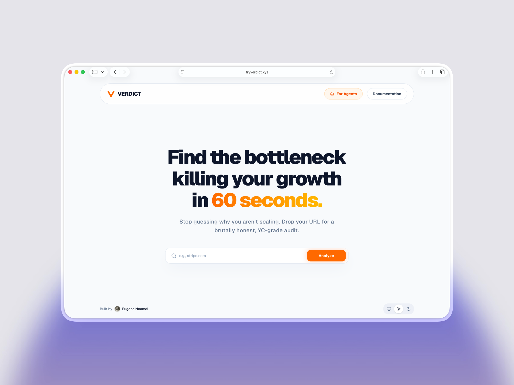
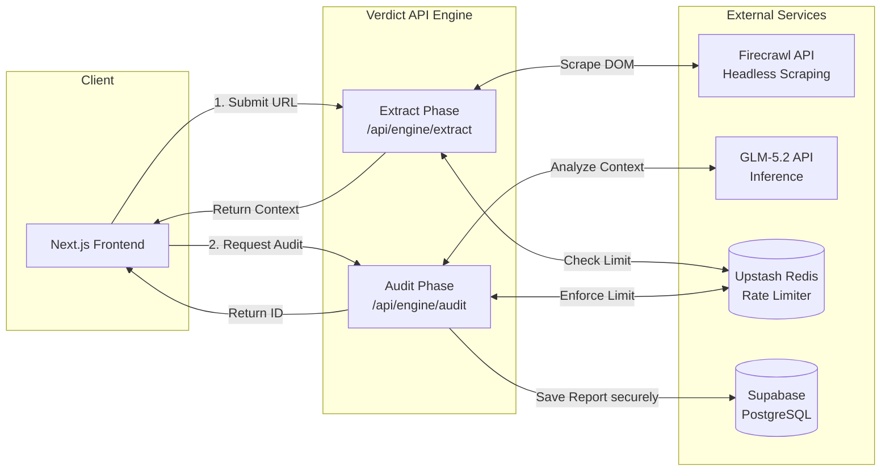

# Verdict

> **Brutal Startup Growth Audit**

  

When founders ask for feedback, they usually get polite nods from friends or superficial critiques from basic AI wrappers ("Looks great! Maybe add a clearer CTA?"). 

**Verdict is different.** It is an autonomous Agent Service Provider (ASP) that performs deep, aggressive, and highly actionable conversion audits. We run headless browsers to scrape the live DOM, process massive context windows using [GLM-5.2](https://huggingface.co/zai-org/GLM-5.2), and deliver a brutally honest teardown, a Growth Readiness Framework (GRF) score, and a clear execution plan with priority matrices.

---

## ✨ Standout Features & Benefits

### 1. Consumer-Grade UX for Enterprise-Grade Analysis
Verdict goes beyond simple prompt wrapping. It features a bespoke, premium UI with an asynchronous processing engine. It handles complex scraping natively, extracts semantic context, and streams structured analysis back to the user, delivering immediate, high-ticket value to startups and founders.

### 2. A Clear Path to Monetization
Landing page audits from human agencies can cost between $500 to $2,000. Verdict automates this entire flow. The platform is pre-built with Upstash Redis rate limiting to protect expensive compute, laying the immediate foundation for a pay-per-audit or subscription-based business model.

### 3. "The Founder's Reality Check" Agent
Most AI tools try to be overly polite. Verdict is intentionally designed with an opinionated, direct, and slightly ruthless persona. It doesn't just summarize a page; it aggressively identifies "Trust Deficits", "Gatekeeping Friction", and "Feature Ratios", turning qualitative design into quantitative metrics (The GRF Score).

---

## ⚙️ Core Features

- **Deep Context Extraction:** Uses Firecrawl to render headless DOMs, bypassing simple HTML scraping to actually "see" the page as a user does.
- **Growth Readiness Framework (GRF):** A proprietary scoring system evaluating FDI (Founder Delusion Index), Trust Deficits, and Intent Friction.
- **GLM-5.2 Intelligence:** Powered by high-context, ultra-fast reasoning models to generate comprehensive, multi-page strategy reports.
- **Secure by Design:** Backend execution is entirely decoupled from the frontend, secured via Supabase Service Role Keys (RLS bypass) and IP-based Upstash Redis rate limiting.
- **Sleek Presentation Layer:** Fully responsive, dark-mode optimized, beautifully animated reports that users want to share.

---

## 🏗️ Architecture

---

## 🛠️ Tech Stack

- **Framework:** Next.js 14 (App Router)
- **Language:** TypeScript (Strict Mode)
- **Styling:** Tailwind CSS + Radix UI + Lucide Icons
- **LLM:** [GLM-5.2](https://huggingface.co/zai-org/GLM-5.2)
- **Web Scraping:** Firecrawl
- **Database:** Supabase (PostgreSQL)
- **Rate Limiting:** Upstash Redis
