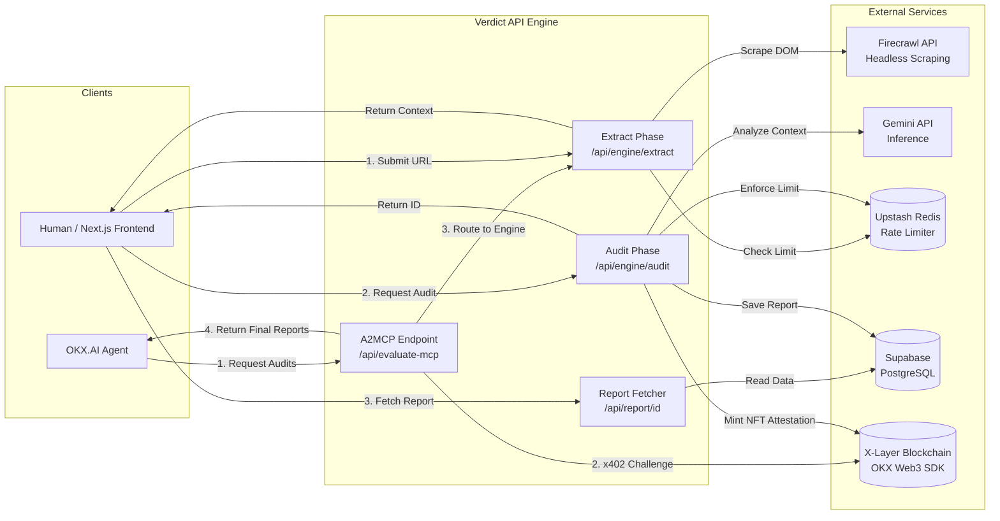

# Verdict

> **Autonomous Growth Auditor**

  

When founders ask for feedback, they usually get polite nods from friends or superficial critiques from basic AI wrappers ("Looks great! Maybe add a clearer CTA?"). 

**Verdict is different.** It is an autonomous Agent Service Provider (ASP) that performs deep, aggressive, and highly actionable conversion audits. We run headless browsers to scrape the live DOM, process massive context windows using [Gemini 3.5 Flash](https://deepmind.google/technologies/gemini/flash/), and deliver a brutally honest teardown, a Growth Readiness Framework (GRF) score, and a clear execution plan with priority matrices.

Verdict operates as a dual-sided platform:
- **For Founders:** Single startup teardowns to harden go-to-market positioning.
- **For VCs & Accelerators:** Automated, bulk deal-flow screening at scale.

---

## Standout Features & Benefits

### 1. Consumer-Grade UX for Enterprise-Grade Analysis
Verdict goes beyond simple prompt wrapping. It features a bespoke, premium UI with an asynchronous processing engine. It handles complex scraping natively, extracts semantic context, and streams structured analysis back to the user, delivering immediate, high-ticket value to startups and founders.

### 2. A Clear Path to Monetization
Landing page audits from human agencies can cost between $500 to $2,000. Verdict automates this entire flow. The platform is pre-built with Upstash Redis rate limiting to protect expensive compute, laying the immediate foundation for a pay-per-audit (0.5 USDT per execution) or subscription-based business model.

### 3. "The Founder's Reality Check" Agent
Most AI tools try to be overly polite. Verdict is intentionally designed with an opinionated, direct, and slightly ruthless persona. It doesn't just summarize a page; it aggressively identifies "Trust Deficits", "Gatekeeping Friction", and "Feature Ratios", turning qualitative design into quantitative metrics (The Growth Readiness Score).

---

## Core Features

- **Deep Context Extraction:** Uses Firecrawl to render headless DOMs, bypassing simple HTML scraping to actually "see" the page as a user does.
- **The 7-Pillar Framework:** Our proprietary scoring system evaluating Positioning & ICP, Messaging & Copy, UX & Friction, Conversion Triggers, Trust & Social Proof, Defensibility (Moat), and overall Growth Readiness.
- **Deterministic AI Engine:** Powered by Gemini 3.5 Flash running at `temperature: 0.0` with strict Structured JSON Schemas. It enforces a ruthless YC-partner persona that judges based on *actual evidence* rather than hallucinations.
- **Secure Mathematical Scoring:** The LLM only extracts raw metrics. The final weighted Growth Readiness Score is computed programmatically by the backend to guarantee absolute fairness and mathematical integrity.
- **Agentic Onboarding:** Seamlessly onboard autonomous agents (Claude, Hermes, Openclaw) by equipping them with the Onchain OS toolkit and a secure Agentic Wallet for micro-payments.
- **Soulbound Onchain Attestation (NFT):** Solves the "fake AI report" problem. When an audit finishes, the AI acts as an autonomous smart-contract auditor, minting an immutable, non-transferable ERC-721 Soulbound NFT (`VERDICT`) directly onto the X-Layer blockchain as cryptographic proof of the score.
- **Exec-Ready Image Export Engine:** A robust service that generates pixel-perfect, branded image exports of the report on the fly, allowing founders to immediately save and share their full audit across social channels or with their team.
- **Secure by Design:** Backend execution is entirely decoupled from the frontend, secured via Supabase Service Role Keys and IP-based Upstash Redis rate limiting.
- **Sleek Presentation Layer:** Fully responsive, dark-mode optimized, beautifully animated reports featuring a premium, Apple-esque UI overhaul.

---

## Architecture

Verdict is engineered as a robust, dual-track pipeline serving both human users and machine-to-machine agents.

### The Dual-Track Execution Rails
- **Human Web App (Next.js):** A highly optimized, asynchronous Next.js 16 App Router application handling UI state, visual loading phases, and error interception. 
- **A2MCP OKX.AI Agent (Dual Endpoints):** Headless, machine-to-machine endpoints designed specifically for the OKX.AI Agent Ecosystem. 
  - `/api/evaluate-mcp`: Single URL teardowns (0.5 USDT).
  - `/api/bulk-evaluate-mcp`: Bulk portfolio screening up to 20 URLs (10.0 USDT).

### Context Normalization & Extraction
Modern SaaS landing pages are heavily client-side rendered and protected by WAFs (Cloudflare/Datadome). 
- The engine spins up headless browsers via the **Firecrawl API** to bypass basic bot protection, execute JavaScript, and wait for DOM stabilization. 
- It aggregates the fully rendered DOM into a massive markdown context window. 
- A resilient waterfall strategy ensures that if Firecrawl hangs, the engine gracefully falls back to **Jina AI**, and finally to a native fetch implementation.

### Cognitive Processing (Gemini 3.5 Flash)
The extracted markdown is passed through a multi-stage reasoning pipeline powered by **Gemini 3.5 Flash**:
- **Phase 1 (De-fluffing):** The model normalizes the text, aggressively stripping away marketing jargon to determine the *true* core value proposition and ensuring the URL is a valid startup.
- **Phase 2 (Scoring & Enforcement):** Operating at `temperature: 0.0`, the model is physically constrained by strict JSON Schemas (Structured Outputs) and aggressive system prompts. This forces it to act as a cynical, pattern-matching investor, assessing the data against the **7-Pillar Framework** based purely on available evidence. The final score is then calculated algorithmically by the backend using strict rubric weights.

### Rate Limiting & Financial Infrastructure
Running headless browsers and large LLM context windows is compute-heavy.
- **The Paywall (Human Path):** Protected by **Upstash Redis**, strictly limiting IPs to a single free audit to prevent abuse and compute drain. Upon limit exhaustion, a client-side paywall modal is rendered.
- **Decentralized Payments (x402 Agent Path):** The OKX.AI API endpoints (`/api/evaluate-mcp` and `/api/bulk-evaluate-mcp`) enforce a strict **x402 payment challenge** for machine-to-machine monetization. 
  1. **Request:** An external AI agent calls the endpoint to request a single or bulk audit.
  2. **Challenge:** The server intercepts and responds with an `HTTP 402 Payment Required` status, providing the payment amount, token address, and the X-Layer recipient address in the headers.
  3. **Autonomous Settlement:** The agent autonomously signs and executes the transaction on the **X-Layer Blockchain** using the OKX Web3 SDK.
  4. **Execution:** Once the payment is verified onchain, the server unlocks the compute (using chunked concurrent processing for bulk requests) and returns the finalized structured JSON audits to the agent.

### Persistence, Delivery & Soulbound Attestations
The final structured audit, complete with priority matrices and pillar scores, is persisted to a **Supabase PostgreSQL** database. 

Crucially, we solve the "fake AI report" trust deficit through cryptographic attestation. Rather than just logging a generic event to the blockchain, our backend Relayer interacts with a custom **ERC-721 Smart Contract (`VerdictAttestation`)** deployed on the **X-Layer**.
- The AI engine autonomously mints a **Soulbound (Non-Transferable) NFT** for every completed audit.
- The NFT's `tokenURI` points permanently to the exact URL of the dynamic report (`report/[id]`).
- When users click the "Attested Onchain" badge on the report, they are taken to the OKX Explorer where they see a clear **"Tokens Transferred: Verdict Attestation (VERDICT)"** banner, proving the AI issued a permanent digital certificate.

The client is then routed to the dynamic `report/[id]` page, instantly rendering the beautifully animated, highly shareable report.

---

## Tech Stack

- **Framework:** Next.js 16 (App Router)
- **Language:** TypeScript (Strict Mode)
- **Styling:** Tailwind CSS + Radix UI + Lucide Icons
- **Payments / A2MCP:** OKX Web3 SDK (x402 standard) + X-Layer
- **LLM:** [Gemini 3.5 Flash](https://deepmind.google/technologies/gemini/flash/)
- **Web Scraping:** Firecrawl
- **Database:** Supabase (PostgreSQL)
- **Rate Limiting:** Upstash Redis

---

## Roadmap: The Autonomous Growth Agency 

Verdict is not just a landing page auditor. We are building a fully autonomous growth agency packaged as a simple tool. 

### Phase 1: The Autonomous Auditor (Live)
Fully operational end-to-end pipeline: Deep DOM extraction via Firecrawl, the 7-Pillar Growth Readiness Framework analysis via Gemini 3.5 Flash, cryptographic score attestations (Soulbound NFTs on X-Layer), and the x402 Agent Payment Gateway.

### Phase 2: Campaign Architecture
You input your goal ("We need 500 beta signups in 30 days with $2k budget"). Verdict reverse-engineers a growth campaign, writes the ad copy, and builds a launch playbook.

### Phase 3: Social & Distribution Audits
Deep-dive audits of your social media presence (X/LinkedIn). Are you shouting into the void, or building an audience? Verdict analyzes your hook-rate and content velocity to build scalable organic flywheels.

### Phase 4: The VC & Accelerator API
VCs and accelerators plug Verdict into their application portals to automatically score and filter the landing pages and growth models of startups applying for funding. 
